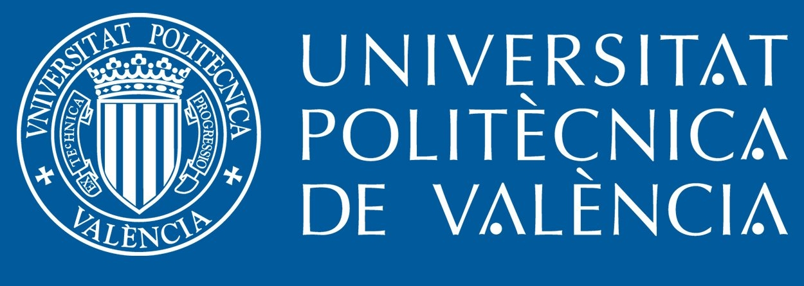
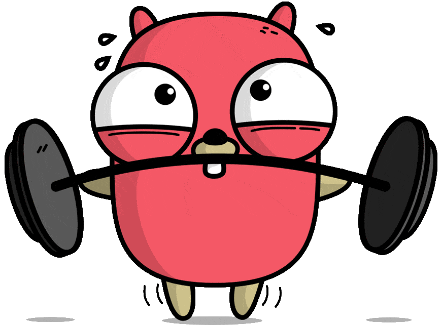
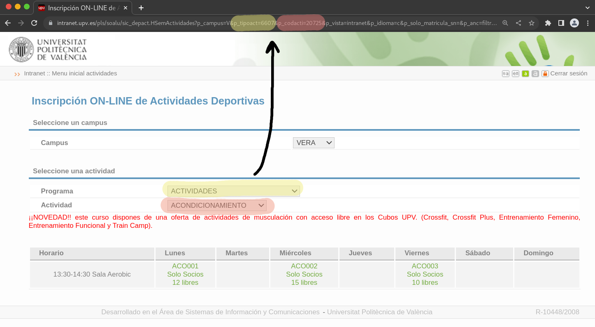

<h1><p align="center">UPV Office of Sports Reservations Agent</p></h1> 

<p align="center">
    <a href="https://www.upv.es/" target="blank"></a>
    
</p>
 
<p align="center">An attempt at automating weekly reservations for the <a href="https://www.upv.es/entidades/AD/" target="blank">Universitat Politècnica de València's Office of Sports</a>, written in <a href="https://go.dev" target="blank">Go</a>.</p>

## 🤔 Why

In July of 2022, the Office of Sports announced that the university's sports facilities will be available free of charge for all students and associated personnel. Although all activities are free, there is limited availability. Some activities follow a first-come first-served policy. Others however, follow a weekly open call for reservations, beggining every Saturday at 10:00. For highly demanded activities, they run out of available slots quickly — in a matter of minutes.

In order to reduce the time spent making reservations, I decided to build a tool that automates the process. Also, serves as an excuse to learn a new programming language. 

## 🤖 How it works

Once configured (see below for details), the agent runs on a set schedule. It uses the amazing `github.com/reugn/go-quartz` library to define two basic triggers — every 15 minutes and every Saturday a 10AM with increased frequency. This maximizes the odds of finding available slots for the desired activity. The methods [`(a *Agent) RunWithScheduler()`](./lib/agent/scheduler.go#L56) and [`(a *Agent) Run()`](./lib/agent/scheduler.go#L13) describe how the triggers are set-up and the process of actualliy making the reservations respectively.

## 🐋 Running with Docker

Read the sections below for configuration details. This repository automatically publishes the contents of the main branch to `joaquinrovira/upv-oos-reservations:latest`and includes multi-architecture support for Linux hosts with `amd64`,`arm64` and `arm/v7` architectures. Once configured you can run the reservation agent as follows:

``` bash
docker run -d --restart=always                                      \
  -v /path/to/local/config.json:/app/config.json                    \
  --env-file .env                                                   \
  --name upv-oos-reservations                                       \
  -e TZ=`timedatectl show | grep "^Timezone=.*\$" | cut -d '=' -f2` \
  joaquinrovira/upv-oos-reservations
```

> *NOTE:* As this is time-sensitive software, **setting the appropriate timezone is vital**. This is done by setting the `TZ` environment variable to a valid value — from the `TZ database name` column of [the following table](https://en.wikipedia.org/wiki/List_of_tz_database_time_zones#List). You can make the container timezone match the host timezone by adding the environment value to the Docker container with the option `-e TZ=$(timedatectl show | grep "^Timezone=.*\$" | cut -d '=' -f2)`. Alternatively, it can be set manually to a value like `-e TZ=Etc/GMT+1`.

You can check the agent logs with `docker logs upv-oos-reservations` and the reservation logs with `docker exec upv-oos-reservations cat /app/output.log`

## 🏗️ Building the agent

Install `go` following the [official instructions](https://go.dev/doc/install). Then, build the binary with the following commands:

```bash
# Clone the repo
git clone https://github.com/joaquinrovira/upv-oos-reservations
cd upv-oos-reservations

# Build the binary
go build .

# Run the executable
./upv-oos-reservations
``` 

## 🛠️ How to configure the agent

There are two configurable aspects of the application. First, environment variables. They can either be set normally or by writing to a `.env` file. Environment variables take precedence over `.env` values. For a full set of configurable environment variables, check out [`vars.go`](./lib/vars/vars.go).

| Variable            | Description                                                                                            |
| ------------------- | ------------------------------------------------------------------------------------------------------ |
| `UPV_USER`          | (*required*) Intranet username                                                                         |
| `UPV_PASS`          | (*required*) Intranet password                                                                         |
| `UPV_ACTIVITY_TYPE` | (*required*) Internal activity type (see section below for more info)                                  |
| `UPV_ACTIVITY_CODE` | (*required*) Internal activity code (see section below for more info)                                  |
| `UPV_LOGIN_TYPE`    | (*optional*) Login type, must be one of `STUDENT` or `PERSONNEL` (does not support for external users) |
| `CUSTOM_CRON`       | (*optional*) Allows the user to define a custom cron trigger                                           |

> *NOTE:* Examples of cron expressions can be found in [`lib/util/cron.go`](lib/util/cron.go#L10-L13). For the exact syntax specification, check out [`reugn/go-quartz`](https://github.com/reugn/go-quartz#cron-expression-format).

Besides environment variables, you will have to specify when you would like your reservations. The agent will read (and watch for changes to) a file named `config.json`. The file [`config.example.json`](./config.example.json) contains an example of the required content:

```json
{
  "Monday": [
    { "Start": { "Hour": 20 }, "End": { "Hour": 23, "Minute": 59 } },
    { "Start": { "Hour": 18 }, "End": { "Hour": 23, "Minute": 59 } }
  ],
  ...
}
```

Each weekday maps to a list of preferred time ranges. Time ranges are assumed to be sorted by decreasing preference. In this example, the agent would try to make a reservation in a slot within the 20:00-23:59 range. If there are no available slots, it will try in the 18:00-23:59 time range. Valid weekdays are `Monday`, `Tuesday`, `Wednesday`, `Thursday`, `Saturday` and `Sunday`. Once the agent is running, the configuration file can be modified and the updated configuration will be applied instead. This is done by watching for changes with the `github.com/fsnotify/fsnotify` package.

### 🔍 How to obtain `UPV_ACTIVITY_TYPE` and `UPV_ACTIVITY_CODE`

As the university does not provide a public API, these values must be scraped or obtained manually. They are easy enough to obtain manually that there is no need to automate the process. Go to the [ON-LINE registration of Sportive Activities](https://intranet.upv.es/pls/soalu/sic_depact.HSemActividades) and select your chosen `Propgram` and `Activity` in the website's form. The new URL will contain multiple parameters. Key among them are `p_tipoact` and `p_codacti`, corresponding to `UPV_ACTIVITY_TYPE` and `UPV_ACTIVITY_CODE` respectively. See the image below for a visual explanation.




## :information_source: Contributing

As there is no official public API, the agent may break at any time. Pull requests are welcome.

## ⚠️ Disclaimer

The UPV **does not authorize** the use of this program. This has been published for **educational purposes only**. 

